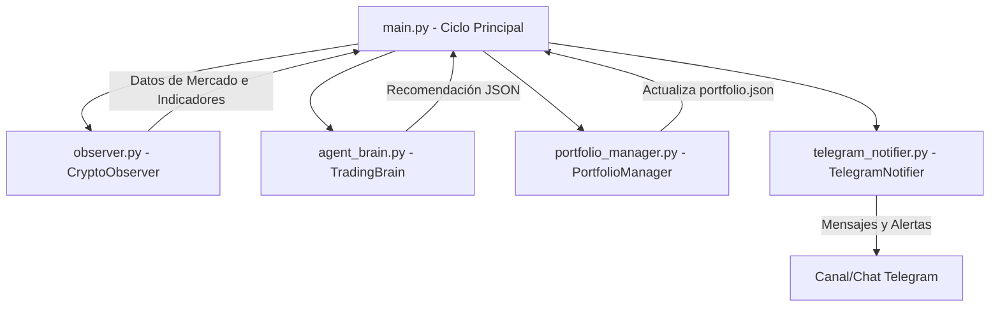

# 🤖 Agent-Trading: Agente de IA para Paper Trading

<p align="center">
  
</p>


[](https://www.python.org/)
[](https://deepmind.google/technologies/gemini/)
[](https://github.com/ccxt/ccxt)

Un agente autónomo de trading cuantitativo impulsado por Inteligencia Artificial (**Gemini 2.5 Flash Lite**) y análisis técnico básico para realizar simulación de trading (Paper Trading) sobre criptomonedas populares como BTC, ETH, SOL y XRP. El agente envía notificaciones instantáneas de cada decisión y ejecución directamente a un canal o chat de **Telegram**.

---

## 📋 Características Principales

*   🔍 **Observación del Mercado**: Monitoreo en tiempo real de precios históricos (OHLCV) en Binance usando CCXT.
*   📊 **Análisis Técnico**: Cálculo automático del Índice de Fuerza Relativa (RSI) y Medias Móviles Exponenciales (EMA de 20 y 50 períodos) con `pandas-ta`.
*   🧠 **Toma de Decisiones por IA**: Evaluación de las métricas del mercado por parte del modelo Gemini, aplicando reglas lógicas y razonamiento dinámico para decidir si **COMPRAR**, **VENDER** o **ESPERAR**.
*   💼 **Simulador de Portafolio (Paper Trading)**: Ejecución y control de operaciones virtuales en USD y tokens, gestionando saldos locales en un archivo `portfolio.json`.
*   ⚡ **Notificaciones por Telegram**: Envío detallado del estado del portafolio, decisiones de la IA y transacciones realizadas con formato enriquecido.

---

## 🛠️ Arquitectura del Sistema

El proyecto se compone de los siguientes módulos estructurados:



### Descripción de Módulos

1.  **`main.py`**: El orquestador que inicia el ciclo (por defecto cada 1 hora). Recolecta los datos, consulta a la IA, ejecuta los intercambios virtuales en base a las recomendaciones, calcula el valor neto del portafolio y lo envía a Telegram.
2.  **`observer.py`** ([CryptoObserver](file:///d:/Programacion/Agent-Trading/observer.py)): Se encarga de descargar las velas del mercado y estimar:
    *   **Tendencia**: `ALCISTA 🟢` (EMA 20 > EMA 50) o `BAJISTA 🔴` (EMA 20 < EMA 50).
    *   **Impulso**: El indicador RSI de 14 períodos para detectar sobrecompra o sobreventa.
3.  **`agent_brain.py`** ([TradingBrain](file:///d:/Programacion/Agent-Trading/agent_brain.py)): Interactúa con la API de Google GenAI enviando un prompt estructurado junto con el estado del mercado, requiriendo y parseando una respuesta en formato JSON estricto.
4.  **`portfolio_manager.py`** ([PortfolioManager](file:///d:/Programacion/Agent-Trading/portfolio_manager.py)): Administra el balance virtual (inicial de $1000.00 USD) y ejecuta las compras o ventas simuladas de $100 USD por operación, guardando el estado en `portfolio.json`.
5.  **`telegram_notifier.py`** ([TelegramNotifier](file:///d:/Programacion/Agent-Trading/telegram_notifier.py)): Utiliza la API de bots de Telegram para publicar los reportes de operaciones.

---

## ⚙️ Requisitos e Instalación

### 1. Clonar el repositorio
```bash
git clone https://github.com/Gabriel-Medina12/Agent-Trading.git
cd Agent-Trading
```

### 2. Instalar dependencias
Instala los paquetes necesarios definidos en `requirements.txt`:
```bash
pip install -r requirements.txt
```

### 3. Configurar variables de entorno
Copia el archivo de plantilla `.env.example` como tu configuración activa:
```bash
cp .env.example .env
```
Edita `.env` con tus propias credenciales:
*   `GOOGLE_API_KEY`: Tu clave de API generada en [Google AI Studio](https://aistudio.google.com/).
*   `TELEGRAM_BOT_TOKEN`: Token obtenido al crear un Bot con [@BotFather](https://t.me/BotFather).
*   `TELEGRAM_CHAT_ID`: Tu ID de chat de Telegram (puedes conseguirlo con bots como [@userinfobot](https://t.me/userinfobot)).

---

## 🚀 Uso y Ejecución

Para iniciar el agente de trading en segundo plano o consola:
```bash
python main.py
```

El script se ejecutará inmediatamente y luego continuará corriendo indefinidamente repitiendo el análisis a intervalos regulares (1 hora por defecto).

### Reporte Recibido en Telegram (Ejemplo):
> 📊 **REPORTE DE OPERACIONES** 🕒 _2026-05-26 19:00:00_
> 
> 🪙 **BTC/USDT**: ESPERAR
> └ _El RSI se encuentra en zona neutral (45.2) y la tendencia es bajista._
> 
> 🪙 **ETH/USDT**: COMPRAR
> └ _RSI en sobreventa (28.4) con tendencia alcista recuperándose._
> 
> ⚡ **EJECUCIÓN:**
> ✅ Compra virtual: 0.031250 ETH/USDT a $3200.0
> 
> 💰 **PORTAFOLIO VIRTUAL**
> 💵 Efectivo: $900.00
> 📈 Valor Total: $1000.00

---

## 🔒 Descargo de Responsabilidad (Disclaimer)

Este software es **únicamente con fines educativos y de simulación (Paper Trading)**. No constituye asesoramiento financiero. El uso de este bot con dinero real corre bajo la total responsabilidad del usuario.
